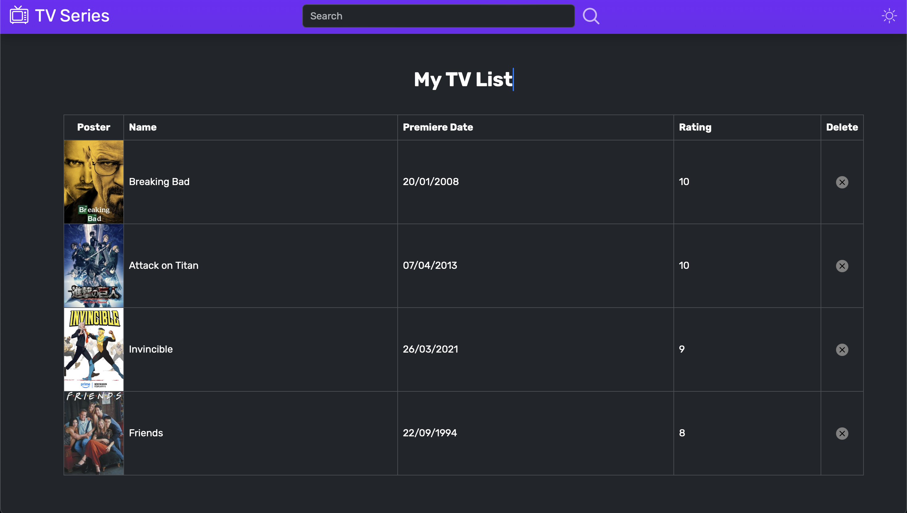

# TV Show List 📺

This website is used to make a list of your favourite TV Shows! It fetches shows from the TVMaze API and allows you to add them to your list with a rating.

## Features 💥
- Dark Mode
- Custom List Name
- Saved TV Show List using a Database
- Basic Error Handling
- Cool SVGs



Made entirely from scratch using Javascript, Bootstrap, Node.js, Express.js, EJS,and MongoDB/Mongoose.


## Installation 🔧

### Requirements
- `git` command line([Windows](https://git-scm.com/download/win) | [Linux](https://git-scm.com/download/linux) | [macOS](https://git-scm.com/download/mac)) installed
- `node` [Version 22.7.0](https://nodejs.org/en) or later installed

### Instructions
1. Clone the repository
```sh
git clone https://github.com/amenhany/tvlist.git
```
2. Install the dependencies
```sh
npm i
```
3. Run the server
```sh
node index.js
```
4. Open the website hosted on port 8080 (localhost:8080)

## To-do 📝
- [ ] Account creation
- [ ] Authentication/Authorization
- [ ] Suggested Shows (Homepage)
- [ ] List Sorting
